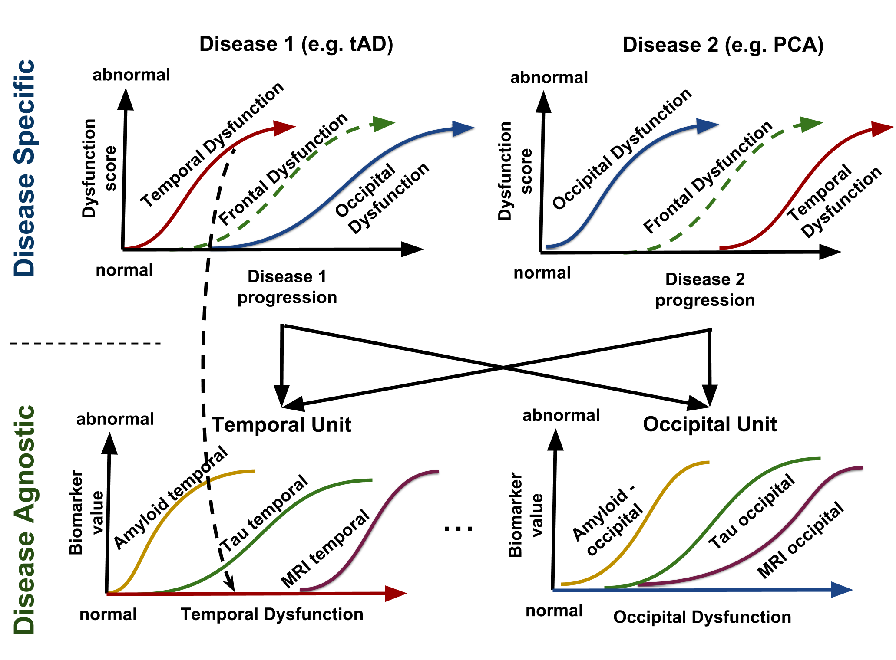

# Disease Knowledge Transfer across Neurodegenerative Diseases
## Razvan V. Marinescu, Marco Lorenzi, Stefano B. Blumberg, Alexandra L. Young, Pere P. Morell, Neil P. Oxtoby, Arman Eshaghi, Keir X. Yong, Sebastian J. Crutch, Polina Golland, Daniel C. Alexander




## Installation

``` 
pip install numpy scipy pandas pickle matplotlib

```

## Running pre-trained models from saved checkpoints

To reproduce the synthetic results in paper pre-trained model, run with "LL" flag. First "L" loads the initialisation, while the second "L" loads the final trained model. 

```
python3 jointSynth.py --runIndex 0 --nrProc 10 --modelToRun 14  --nrRows 3 --nrCols 4 --runPartStd LL --expName synth1
```

To reproduce the results with ADNI + DRC data from pre-trained model, using saved checkpoint, run:

```
python3 tadpoleDrc.py --runIndex 0 --nrProc 10 --modelToRun 14  --nrRows 4 --nrCols 6 --penalty 5 --runPartStd LL --tinyData
```

To run DKT on 3 pre-defined subgroups from TADPOLE (Hippocampal, Cortical, Subcortical) defined by the SuStaIn model (Young et al, Nature Comms, 2018), run:

```
  python3 tadpoleSubtypes.py --runIndex 0 --nrProc 1 --modelToRun 14  --nrRows 4 --nrCols 6 --runPartStd RR --tinyData
```

To run model comparison from saved checkpoints, run with --modelToRun=0 (i.e. run all models). This only works in LL mode. 

```
python3 tadpoleDrc.py --runIndex 0 --nrProc 10 --modelToRun 0  --nrRows 5 --nrCols 7 --runPartStd LL --tinyData
```


## Training new models

To train a new model, run the commands above with "RR" flags. If you run on a different dataset, you have to put them in the same .csv format as those under data/ and data_processed/. For example, to train on the TADPOLE + DRC data, run:

```
python3 tadpoleDrc.py --runIndex 0 --nrProc 10 --modelToRun 14  --nrRows 4 --nrCols 6 --penalty 5 --runPartStd RR --tinyData
```

## Running other models

To run the Disease progression Score model by Jedynak et al, NeuroImage, 2012, simply run:

```
  python3 tadpoleDrc.py --runIndex 0 --nrProc 10 --modelToRun 17  --nrRows 5 --nrCols 7 --runPartStd RR --tinyData
```

